# 🚁 Awesome Drone Fleet Management

  

  
  
  
  
  
  
  

---

## 📌 Ecosystem Overview & Market Intelligence

A curated list of **SaaS products**, enterprise software, and **open-source GitHub projects** dedicated to **Drone Fleet Management**, autonomous UAV swarm control, MAVLink telemetry synchronization, BVLOS mission planning, and airspace compliance.

Whether you are managing commercial surveying fleets, public safety UAV units, agricultural mapping systems, or developing self-hosted open-source ground control stations (GCS), this resource covers the entire software stack.

---

## 📑 Table of Contents

- [📊 SaaS & Commercial Platforms](#-saas--commercial-platforms)
- [🔓 Open-Source GitHub Projects](#-open-source-github-projects)
- [🛠️ Architecture & Integration Guidance](#%EF%B8%8F-architecture--integration-guidance)
- [🤝 How to Contribute](#-how-to-contribute)
- [⚠️ Regulatory & Safety Disclaimer](#%EF%B8%8F-regulatory--safety-disclaimer)
- [📈 Star History](#-star-history)

---

## 📊 SaaS & Commercial Platforms

### 📈 Market Size & Industry Dynamics
> 💡 **Market Size & Structure:** The global drone fleet management software market is estimated at **$1.65 Billion in 2026** and is projected to expand to **$4.8 Billion by 2030 (CAGR of ~23.5%)**. The industry is **moderately fragmented**: enterprise leaders such as DroneDeploy and Skyward (Verizon) hold major shares in automated mapping and airspace authorizations, while high-growth specialized platforms command dedicated niches in autonomous docking stations (FlytBase), telemetry analytics (AirData UAV), public safety response (DroneSense), and photogrammetry (Pix4D).

Below is a detailed comparison of leading commercial platforms, **sorted by company size / valuation (descending)**:

| 🏢 Platform | 📝 Overview & Core Capabilities | 💰 Specific Pricing | 🎁 Free Tier / Trial Limits | 📊 Est. Valuation / Revenue |
| :--- | :--- | :--- | :--- | :--- |
| **[DroneDeploy](https://www.dronedeploy.com/)** | Autonomous flight planning, real-time aerial mapping, thermal inspection, and enterprise fleet tracking for construction, agriculture, and energy sectors. | Starts at **$99/month** (Individual Lite) / **$329/month** (Advanced Flight) | **14-day free trial** (Includes up to 50 photos per map export limit) | **~$500M Valuation** ($142M+ raised, $50M+ ARR) |
| **[Skyward](https://skyward.io/)** *(Verizon Robotics)* | Enterprise UAV flight management, automated FAA LAANC airspace authorization, pilot management, and cellular connectivity tracking. | Starts at **$49/pilot/month** (Standard plan) | **30-day free trial** (Full airspace access & flight logging for up to 3 pilots) | **~$100M Acquisition Value** (Acquired by Verizon Communications) |
| **[FlytBase](https://www.flytbase.com/)** | Enterprise autonomous drone dock operations, remote BVLOS control, live video streaming, and payload management console. | Starts at **$49/drone/month** (FlytNow Cloud Starter) | **14-day free trial** (Full platform features, max 2 connected drones) | **~$60M Valuation** ($15M+ Series A funding, $10M+ ARR) |
| **[Aloft](https://www.aloft.ai/)** *(formerly Kittyhawk)* | FAA-approved LAANC airspace intelligence, real-time compliance monitoring, fleet maintenance logging, and pilot currency tools. | Starts at **$100/month** (AirControl Team Starter) | **Free Forever Mobile App** (LAANC airspace checks & basic flight logging for solo pilots) | **~$500M Valuation** ($50M+ valuation, $8M+ ARR) |
| **[Delair.ai](https://delair.ai/)** | Cloud-based drone data management, visual asset inspection, photogrammetry analytics, and linear infrastructure monitoring. | Starts at **$250/month** (Delair Cloud Starter) | **14-day free trial** (Includes sample inspection dataset & 2D orthomosaic viewer) | **~$45M Valuation** ($25M+ funding raised, $7M+ ARR) |
| **[Pix4Dcloud](https://www.pix4d.com/)** | Cloud photogrammetry platform converting UAV aerial imagery into georeferenced 2D maps, 3D point clouds, and elevation models. | Starts at **$290/month** (Pix4Dcloud Monthly) | **15-day free trial** (Full cloud processing and 3D mesh model generation) | **~$40M ARR** (~$50M Estimated Corporate Valuation) |
| **[DroneSense](https://www.dronesense.com/)** | Comprehensive UAV mission control built specifically for public safety, emergency response, law enforcement, and search & rescue (SAR). | Starts at **$1,200/drone/year** (~$100/drone/mo) | **30-day free trial** (Available for verified public safety & emergency response agencies) | **~$35M Valuation** (Axon Ecosystem Partner, $8M+ ARR) |
| **[AirData UAV](https://airdata.com/)** | Automated drone telemetry log sync, battery health degradation analytics, pilot maintenance alerts, and FAA compliance reporting. | Starts at **$7/month** (HD 360 Individual) / **$179/mo** (Enterprise) | **Free Forever Plan** (1 pilot, up to 100 flight logs/mo & basic telemetry sync) | **~$25M Valuation** ($5M+ ARR) |
| **[UgCS Cloud](https://www.ugcs.com/)** | Advanced 3D drone mission planning software with terrain following, LIDAR survey routes, and remote multi-drone fleet monitoring. | Starts at **$60/month** (UgCS PRO Subscription) | **14-day free trial** (Full 3D terrain-following mission planning & telemetry sync) | **~$20M Valuation** ($4M+ ARR) |
| **[FlyFreely](https://flyfreely.com/)** | Multi-jurisdiction drone risk management, mission approvals, operational compliance workflows, and pilot maintenance tracking. | Starts at **$150/month** (Office Starter Plan) | **14-day free trial** (Includes pilot currency tracking & mission approval workflow) | **~$15M Valuation** ($3M+ ARR) |

---

## 🔓 Open-Source GitHub Projects

The open-source UAV software stack provides self-hosted alternatives, MAVLink ground station controls, autonomous flight control stacks, and swarm coordination frameworks.

Below is the complete curated open-source index, **sorted by GitHub Star Count (descending)**:

| 📦 Open-Source Project | ⭐ GitHub Stars | 📝 Key Capabilities & Focus |
| :--- | :---: | :--- |
| **[ArduPilot](https://github.com/ArduPilot/ardupilot)** |  | Premier open-source autopilot system supporting multirotors, fixed-wing aircraft, rovers, and subs with full telemetry & mission execution. |
| **[PX4 Autopilot](https://github.com/PX4/PX4-Autopilot)** |  | Industrial-grade open-source flight control stack for drones and uncrewed vehicles, driving PX4-compatible hardware & SITL simulators. |
| **[Traccar GPS Platform](https://github.com/traccar/traccar)** |  | Multi-protocol server supporting 2,000+ device models for real-time positioning, geofencing, WebSockets, and self-hosted fleet management. |
| **[QGroundControl](https://github.com/mavlink/qgroundcontrol)** |  | Cross-platform (Desktop/Mobile) MAVLink Ground Control Station (GCS) providing full vehicle setup, flight monitoring, and waypoints. |
| **[Fleetbase](https://github.com/fleetbase/fleetbase)** |  | Modular open-source logistics operating system featuring real-time GPS tracking, vehicle dispatch, API integration, and routing. |
| **[Prometheus](https://github.com/amov-lab/prometheus)** |  | Autonomous drone software stack based on PX4 & ROS, providing vision navigation, target tracking, formation control, and swarm testing. |
| **[MAVLink Protocol](https://github.com/mavlink/mavlink)** |  | Lightweight header-only messaging protocol for communicating with drones and between onboard UAV components. |
| **[DroneKit Python SDK](https://github.com/dronekit/dronekit-python)** |  | Python library for creating custom ground station apps, automated mission scripts, and companion computer flight controller logic. |
| **[MAVSDK](https://github.com/dronecode/MAVSDK)** |  | Modern C++, Python, Swift, Java, and Go SDK for interacting with MAVLink systems over a gRPC architecture. |
| **[Mission-Directed Swarm (MDS)](https://github.com/alireza787b/mavsdk_drone_show)** |  | Open-source platform for drone light shows, swarm mission planning, SAR operations, SITL testing, and AI operator feasibility betas. |
| **[Skybrush Server](https://github.com/skybrush-io/skybrush-server)** |  | Core backend server suite for drone light shows, supporting trajectory validation, clock synchronization, and multi-vehicle orchestration. |
| **[ArduPilot WebTools](https://github.com/ArduPilot/WebTools)** |  | Browser-based suite of tools for ArduPilot flight log analysis (AP_CloudView), telemetry monitoring, and online parameter editing. |
| **[MultiUAV-GUI](https://github.com/alvcaballero/multiuav_gui)** |  | ROS-integrated multi-user web ground station for heterogeneous drone fleets, waypoint mission planning, and live video feeds. |
| **[Karshipta Fleet Console](https://github.com/NIKX-Tech/karshipta)** |  | Self-hosted C2 console for MAVLink drones & non-autopilot GPS trackers (Herald gateway) with independent fleet mission routes. |
| **[SkyCommand](https://github.com/vishant007/drone-management-system)** |  | Autonomous UAV management platform built with React 18, TypeScript, Leaflet map tiles, and WebSockets for real-time telemetry. |

---

## 🛠️ Architecture & Integration Guidance

When building custom drone fleet management software:
1. **Ground Control & Autopilot Base:** Utilize **[QGroundControl](https://github.com/mavlink/qgroundcontrol)** alongside **[PX4](https://github.com/PX4/PX4-Autopilot)** or **[ArduPilot](https://github.com/ArduPilot/ardupilot)** for core vehicle configuration, safety failsafes, and MAVLink communications.
2. **Fleet Operations & Ingestion:** Deploy **[Karshipta](https://github.com/NIKX-Tech/karshipta)** or **[Traccar](https://github.com/traccar/traccar)** to consolidate live map tracking across MAVLink telemetry and cellular GPS trackers.
3. **Swarm & Mission Orchestration:** Leverage **[MAVSDK](https://github.com/dronecode/MAVSDK)** or **[Mission-Directed Swarm (MDS)](https://github.com/alireza787b/mavsdk_drone_show)** for multi-vehicle waypoint planning, synchronized trajectories, and ROS-based autonomy.

---

## 🤝 How to Contribute

Contributions are highly appreciated! Please follow these guidelines:

1. Fork the repository.
2. Add your SaaS product or Open-Source project to `README.md` following the table format.
3. Provide factual descriptions, specific starting pricing/free tier limits, and accurate GitHub repository links.
4. Submit a Pull Request (PR) with a clear title and summary.

Check out [Awesome-Awesome-Awesome](https://github.com/ishandutta2007/Awesome-Awesome-Awesome) for more curated lists!

---

## ⚠️ Regulatory & Safety Disclaimer

- Drone operations must adhere to relevant aviation regulations (such as FAA Part 107 in the US, EASA rules in Europe, or local CAA regulations).
- BVLOS (Beyond Visual Line of Sight) and automated swarm flights require proper waiver approvals and airspace clearance (e.g., LAANC).
- Open-source platforms (including MDS, PX4, and ArduPilot) are provided for research and development; independent field validation and safety reviews are required prior to commercial deployment.

---

## 📈 Star History

---

  Made with ❤️ for UAV Technologists, Drone Operators &amp; Robotics Engineers.

